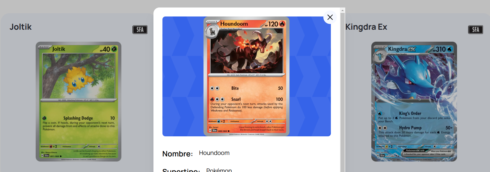

# Prueba Fullstack - Pokémon TCG API y Frontend



## Descripción

API y frontend con información de los sets y cartas del juego Pokémon TCG.

Monorepo utilizando NX Workspaces, NestJS, NextJS y Postgresql

## Comenzar

Clonar proyecto

```bash
git clone https://github.com/jsanhuez/lab_prueba_fullstack.git
```

Ir a la raíz del monorepo

```bash
cd lab_prueba_fullstack
```

Instalar dependencias

```bash
npm install
```

## Variables de entorno

Copiar archivo `.env.example` y renombrar a `.env` y reemplazar valores

## Ejecutar

### Levantar contenedores con docker compose

```bash
docker compose up
```

### Ejecutar proyectos:

- Todos en un solo comando:

  ```bash
  npm run start:dev
  ```

- Por separado:

  - Backend

    ```bash
    npm run start:api
    ```

  - Frontend

    ```bash
    npm run start:front
    ```

La ruta para frontend por defecto es: `http://localhost:3000/`

La ruta para backend por defecto es: `http://localhost:4001/`

## Collection en Postman

Importar en Postman la colección `Pokemon TCG.postman_collection.json`, archivo que se encuentra en la raíz del monorepo.
